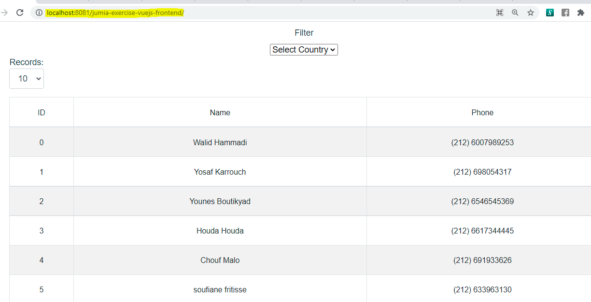

# Jumia Exercise VUE.JS (Front-end).

# Overview
This is a Front-end Web Application implemented using VUE.JS Framework. It is a single web application page for calling the REST APIs that was implemented using Spring Boot back-end through HTTP calls to represent the list of customers phone numbers and provide a capability of filtering the list by chosing the country from a dropdown menu which validates phone numbers and represent the list of customers from the selected country listing both the valid and not valid phone numbers. 

Pagination is applied on the list of phone numbers.

## Main technology stack

* Node.js/NPM (6.14.14)
* vueJS (4.5.13)
* axios (^0.21.1)
* vue-axios (^3.2.5)
* vue-tables-2 (^2.3.1)
* VuePagination
* Dockerfile (for the ability to build the project in a docker image)
* Visual Studio Code (IDE)




## Clone Repository
```
git clone https://github.com/omosttafa/jumia-exercise-vuejs-frontend.git
cd jumia-exercise-vuejs-frontend
```

## Project setup
```
cd jumia-exercise-vuejs-frontend
npm install
```

## Install VUE CLI
```
npm install -g @vue/cli
```

### Instal axios & vue-axios for HTTP calls from Vue.js to (Spring Boot) REST backend
```
npm install --save axios vue-axios
```

### Instal vue-tables-2 packages
```
npm install vue-tables-2
```

### Compiles and hot-reloads for development
```
npm run serve
```

### Compiles and minifies for production 

If you only want to test the web application locally don't run this command.

```
npm run build
```

```
 DONE  Compiled successfully in 28220ms                                                                       3:44:14 AM


  App running at:
  - Local:   http://localhost:8081/
  - Network: http://192.168.0.117:8081/

  Note that the development build is not optimized.
  To create a production build, run npm run build.
```

### Open web page from any browser using the local URL
```
http://localhost:8081/jumia-exercise-vuejs-frontend/
```


